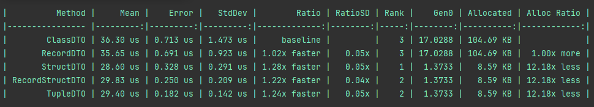
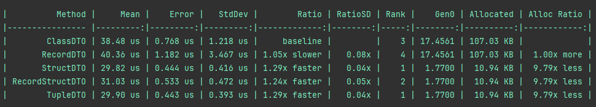
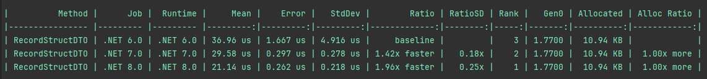
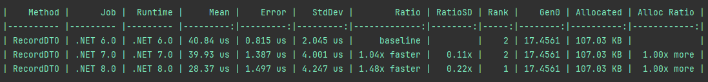
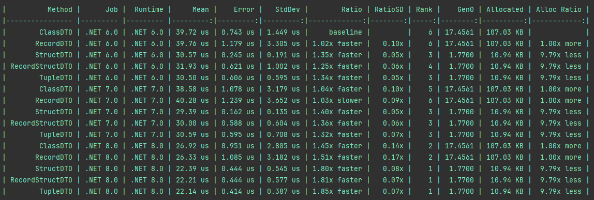

# DTO performance tests

## How to run?
This project contains two types of tests. You need to navigate to the selected class and uncomment the lines starting with 
**BenchmarkRunner.Run<**
```csharp
//BenchmarkRunner.Run<Benchmark>();
```
or
```csharp
// BenchmarkRunner.Run<BenchmarkObjectResult>();
```
### Comparison of reference and value types
To choose basic comparison test of each reference and value types please go to the Program.cs file.


### Comparison of reference and value types transported in ObjectResult reference type
To choose extended comparison test of each reference and value types please go to the Program.cs file.
In this comparision, the object under test is used as a property in a reference type similar to ObjectResult class, which is used by DotNetCore controllers.


#### Comparison of value types transported in ObjectResult reference type in different DotNet versions


#### Comparison of reference types transported in ObjectResult reference type in different DotNet versions


### Comparison of reference and value types transported in ObjectResult reference type in different DotNet versions
