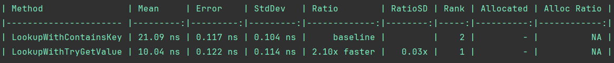
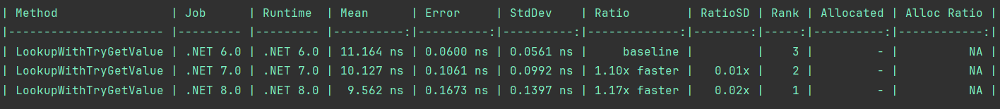

# Dictionary Key Lookup

### Compare TryGetValue and ContainsKey methods of Dictionary class

### Compare TryGetValue in different versions of DotNet

### Conclusions
Always use TryGetValue method to check if the key exists in the dictionary.