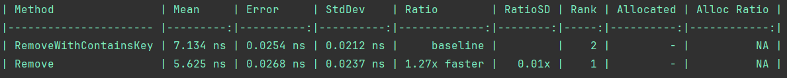

# Dictionary Key Lookup

## Key lookup
### Compare TryGetValue and ContainsKey methods of Dictionary class

### Compare TryGetValue in different versions of DotNet

## Remove

## Conclusions
Always use TryGetValue method to check if the key exists in the dictionary.