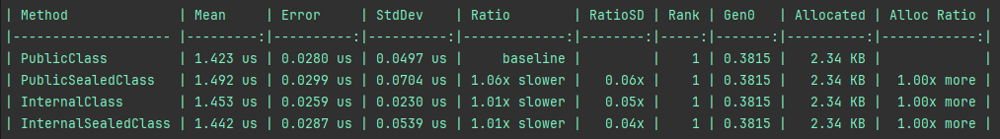
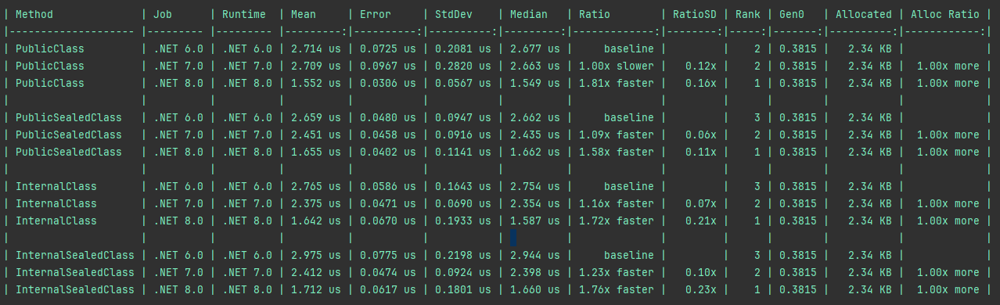
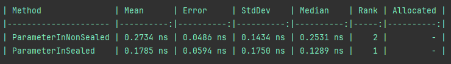
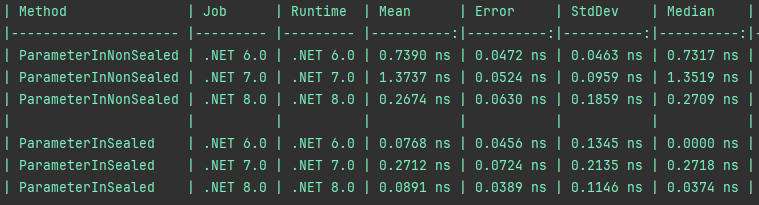

# Internal sealed class benchmark

## How to run?
This project contains two types of tests. You need to navigate to the selected class and uncomment the lines starting with 
**BenchmarkRunner.Run<**
```csharp
//BenchmarkRunner.Run<Benchmark>();
```
or
```csharp
// BenchmarkRunner.Run<ParameterInSealedBenchmark>( /*new DebugInProcessConfig()*/);
```
### Comparison of getting types from IoC container
Benchmark testing different types of classes registered as transient in IoC container and taking an instance from it.
Navigate to the Program.cs file.
#### For DotNet 8, a comparison of different types of objects

#### Comparision of different versions of DotNet


### Comparison of manipulating property in object
#### For DotNet 8, a comparison of different types of objects

#### Comparision of different versions of DotNet

