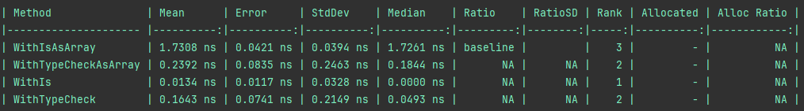
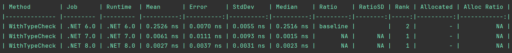
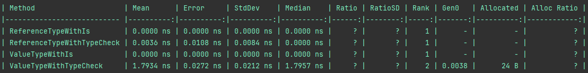

# Type checking benchmark

## How to run?
This project contains two types of tests. You need to navigate to the selected class and uncomment the lines starting with
**BenchmarkRunner.Run<**
```csharp
//BenchmarkRunner.Run<GenericsBenchmark>( /*new DebugInProcessConfig()*/);
```
or
```csharp
// BenchmarkRunner.Run<CollectionsBenchmark>( /*new DebugInProcessConfig()*/);
```
### Checking the type of collection
Navigate to the [CollectionsBenchmark.cs](CollectionsBenchmark.cs) file.

#### comparison with different versions of DotNet


### Checking the type in the generic class
Navigate to the [GenericsBenchmark.cs](GenericsBenchmark.cs) file.


# Conclusions
## Always use **is** to checks if the result of an expression is compatible with a given type.
I've known only one exception where GetType and typeof is faster. 
When you checking IEnumerable type passing array
```csharp
private IEnumerable<int> _source = (int[])(object)new uint[42];

_source is int[]
// is slower then
_source.GetType() == typeof(int[])    
```
For more details go to [CollectionsBenchmark.cs](CollectionsBenchmark.cs)